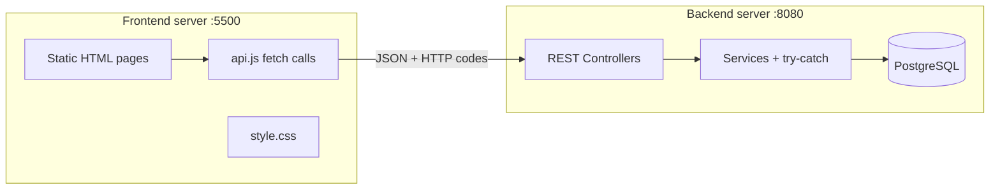

# Auth Project: REST API + Separated Frontend Plan

## What you asked for (items 1, 3, 4, 5)

| Item | Your requirement | Current state |
|------|------------------|---------------|
| **1** | User ID = date + time (unique) | Auto-increment `Long` via `@GeneratedValue(IDENTITY)` in [`User.java`](src/main/java/com/authentication/AuthProject/entity/User.java) |
| **3** | Try-catch, error handling, validation | Manual `hasMissingFields()` in [`SignupRequest.java`](src/main/java/com/authentication/AuthProject/dto/SignupRequest.java); services return `Optional<String>` errors; no `@ControllerAdvice`, no try-catch |
| **4** | Frontend and backend on different servers | Single Spring Boot app serves Thymeleaf + static CSS on one port |
| **5** | HTTP status codes for responses | `@Controller` redirects (302) + flash messages — no REST status codes |

**Also in scope (explicitly requested):** Lombok on all models/DTOs; required-field `*` marks on forms.

---

## Why the current code lacks these

The project was built as a **server-rendered MVC learning app**, not a REST API:

1. **Thymeleaf pattern** — forms POST to controllers, which redirect with flash messages. HTTP 302 + HTML is normal here; status codes like 400/404 are not used.
2. **Manual validation** — `spring-boot-starter-validation` is missing from [`pom.xml`](pom.xml), so Jakarta Bean Validation (`@NotBlank`, `@Email`) was never wired in.
3. **Lombok added but not applied** — [`User.java`](src/main/java/com/authentication/AuthProject/entity/User.java) has `@Getter/@Setter` **and** duplicate hand-written getters/setters. DTOs have zero Lombok. Comments like `//Use getter-setter annotations` in [`LoginRequest.java`](src/main/java/com/authentication/AuthProject/dto/LoginRequest.java) were left as TODOs.
4. **No global error layer** — errors are returned as `Optional<String>` and checked in controllers; no exceptions, no `@RestControllerAdvice`.
5. **Known bug** — [`edit-profile.html`](src/main/resources/templates/edit-profile.html) and [`change-password.html`](src/main/resources/templates/change-password.html) use `method="post"` but controllers use `@PutMapping` in [`UserController.java`](src/main/java/com/authentication/AuthProject/controller/UserController.java), so updates likely never hit the backend.

---

## Target architecture



- **Backend:** Spring Boot REST API only (`/api/**`), port `8080`
- **Frontend:** Plain HTML/CSS/JS in a new `frontend/` folder, served separately (e.g. `npx serve frontend -p 5500`)
- **CORS:** Backend allows `http://localhost:5500` (configurable via properties)

---

## Phase 1 — Dependencies and Lombok cleanup

**File:** [`pom.xml`](pom.xml)

- Add `spring-boot-starter-validation`
- Remove `spring-boot-starter-thymeleaf` (no longer needed after frontend split)

**Apply Lombok consistently** — remove all hand-written getters/setters/constructors:

| Class | Lombok annotations |
|-------|-------------------|
| [`User.java`](src/main/java/com/authentication/AuthProject/entity/User.java) | `@Getter @Setter @NoArgsConstructor` — keep `@PrePersist`/`@PreUpdate` methods |
| All DTOs | `@Getter @Setter @NoArgsConstructor` |
| Services / controllers | `@RequiredArgsConstructor` (constructor injection without boilerplate) |

**Why Lombok?** It generates getters, setters, and constructors at compile time so you maintain one annotation instead of 50+ lines of boilerplate per class. JPA still needs a no-args constructor — `@NoArgsConstructor` covers that.

---

## Phase 2 — Date-time unique ID

**File:** new [`util/IdGenerator.java`](src/main/java/com/authentication/AuthProject/util/IdGenerator.java)

Generate ID at signup as a `Long` from timestamp pattern:

```java
// Example: 20260720162130123  (yyyyMMddHHmmssSSS)
DateTimeFormatter.ofPattern("yyyyMMddHHmmssSSS")
```

**File:** [`User.java`](src/main/java/com/authentication/AuthProject/entity/User.java)

- Remove `@GeneratedValue(strategy = GenerationType.IDENTITY)`
- Set `id` manually in `@PrePersist` (or in `AuthService.signup` before `save`)
- Add collision retry: if `repository.existsById(id)`, regenerate (handles same-millisecond signups)

**Important:** Existing DB rows use sequential IDs (`1`, `2`, …). After this change, run `DROP TABLE users` or truncate before testing, since Hibernate `ddl-auto=update` will not migrate ID strategy cleanly.

---

## Phase 3 — Validation, try-catch, and global error handling

### 3a. Bean Validation on DTOs

Add Jakarta annotations (examples):

- **SignupRequest:** `@NotBlank` on names/phone/password, `@Email`, `@NotNull` on dob/gender, `@Past` on dob
- **LoginRequest:** `@NotBlank` + `@Email`
- **UpdateProfileRequest / ChangePasswordRequest:** same pattern

Remove `hasMissingFields()` from `SignupRequest` — validation framework replaces it.

### 3b. Custom exceptions (new package `exception/`)

| Exception | HTTP code |
|-----------|-----------|
| `ResourceNotFoundException` | 404 |
| `DuplicateResourceException` | 409 |
| `InvalidCredentialsException` | 401 |
| `ValidationException` / use Spring's `MethodArgumentNotValidException` | 400 |
| `BadRequestException` (password mismatch) | 400 |

### 3c. Global handler

New [`GlobalExceptionHandler.java`](src/main/java/com/authentication/AuthProject/exception/GlobalExceptionHandler.java) with `@RestControllerAdvice`:

- Returns JSON `ApiErrorResponse` (timestamp, status, message, field errors)
- Maps each exception to the correct `@ResponseStatus`
- Catches `DataIntegrityViolationException` in services with try-catch for DB unique-constraint races

### 3d. Service layer changes

Refactor [`AuthService.java`](src/main/java/com/authentication/AuthProject/service/AuthService.java) and [`UserService.java`](src/main/java/com/authentication/AuthProject/service/UserService.java):

- Replace `Optional<String>` error returns with **throw exceptions**
- Wrap `repository.save()` in try-catch for `DataIntegrityViolationException`
- Login returns user ID directly; throws `InvalidCredentialsException` on failure (eliminates duplicate DB lookup in `getLoginError`)

---

## Phase 4 — REST controllers with HTTP status codes

Replace MVC controllers with REST controllers (delete or repurpose [`AuthController.java`](src/main/java/com/authentication/AuthProject/controller/AuthController.java) and [`UserController.java`](src/main/java/com/authentication/AuthProject/controller/UserController.java)):

| Method | Endpoint | Success code | Error codes |
|--------|----------|--------------|-------------|
| POST | `/api/auth/signup` | **201 Created** + `{ userId }` | 400 validation, 409 duplicate email/phone |
| POST | `/api/auth/login` | **200 OK** + `{ userId }` | 401 invalid credentials |
| GET | `/api/users/{id}` | **200 OK** + `UserResponse` | 404 not found |
| PUT | `/api/users/{id}` | **200 OK** + updated profile | 400 validation, 404, 409 phone conflict |
| PUT | `/api/users/{id}/password` | **200 OK** + message | 400 mismatch, 401 wrong current password, 404 |

Use `@RestController`, `@Valid @RequestBody`, and `@ResponseStatus` / `ResponseEntity` where appropriate.

**Health check:** keep `GET /` returning `"Project is Running"` or move to `/api/health`.

---

## Phase 5 — CORS and backend config

New [`config/CorsConfig.java`](src/main/java/com/authentication/AuthProject/config/CorsConfig.java):

```java
registry.addMapping("/api/**")
    .allowedOrigins("http://localhost:5500")
    .allowedMethods("GET", "POST", "PUT", "OPTIONS")
    .allowedHeaders("*");
```

**File:** [`application.properties`](src/main/resources/application.properties)

```properties
app.cors.allowed-origins=http://localhost:5500
server.port=8080
```

---

## Phase 6 — Separate static frontend

Create `frontend/` at project root (outside `src/main/resources`):

```
frontend/
  index.html          → redirect to login.html
  login.html
  signup.html
  home.html
  profile.html
  edit-profile.html
  change-password.html
  css/style.css       → copy + extend current styles
  js/config.js        → const API_BASE = "http://localhost:8080"
  js/api.js           → fetch wrappers (handle status codes)
  js/auth.js          → login/signup logic
  js/user.js          → profile/edit/password logic
```

### Frontend behavior changes

- Forms use `event.preventDefault()` + `fetch()` to backend API
- Read `userId` from `localStorage` after login (replaces URL-only auth for now)
- Display errors from JSON response body based on HTTP status
- Navigation links pass `?id=` or read from `localStorage`

### Required field star marks

Add labels with asterisk to every required field on all form pages:

```html
<label>First Name <span class="required">*</span></label>
<input type="text" name="firstName" required>
```

**CSS addition** in `frontend/css/style.css`:

```css
.required { color: #dc3545; margin-left: 2px; }
```

Apply to: login (email, password), signup (all 7 fields), edit-profile (5 fields), change-password (3 fields).

---

## Phase 7 — Cleanup

- Remove [`src/main/resources/templates/`](src/main/resources/templates/) (replaced by `frontend/`)
- Remove [`src/main/resources/static/style.css`](src/main/resources/static/style.css) (moved to frontend)
- Update [`docker-compose.yml`](docker-compose.yml) optionally with a `frontend` service (nginx or `http-server`) for local dev

---

## File change summary

| Action | Files |
|--------|-------|
| **Modify** | `pom.xml`, `User.java`, all DTOs, `AuthService.java`, `UserService.java`, `UserRepository.java`, `application.properties` |
| **Create** | `IdGenerator.java`, `CorsConfig.java`, `GlobalExceptionHandler.java`, `ApiErrorResponse.java`, exception classes, `AuthRestController.java`, `UserRestController.java`, entire `frontend/` folder |
| **Delete** | `AuthController.java`, `UserController.java`, Thymeleaf templates, `src/main/resources/static/` |

---

## HTTP status code reference (what frontend will handle)

| Code | When |
|------|------|
| 200 | Login success, profile fetch/update, password change |
| 201 | Signup success |
| 400 | Validation failure, password confirmation mismatch |
| 401 | Wrong email/password on login or wrong current password |
| 404 | User ID not found |
| 409 | Email or phone already registered |
| 500 | Unexpected server error (logged in backend try-catch) |

---

## Testing checklist

1. Start PostgreSQL (`docker compose up -d`)
2. Clear/truncate `users` table (ID strategy change)
3. Start backend: `./mvnw spring-boot:run` → `http://localhost:8080`
4. Start frontend: `npx serve frontend -p 5500` → `http://localhost:5500`
5. Signup → verify ID looks like `20260720162130123`
6. Login → redirected to home with stored userId
7. Profile view/edit/password change → correct HTTP codes on success and failure
8. Duplicate email signup → 409
9. Empty required field → 400 with field errors
10. Required fields show red `*` in UI
